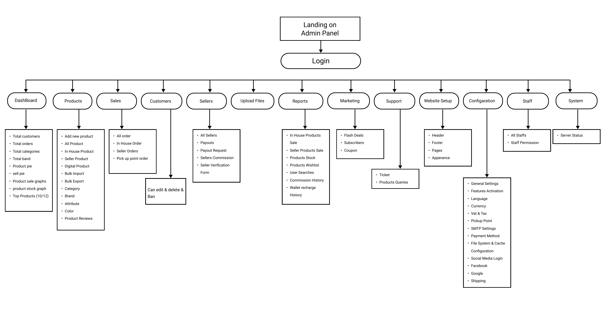
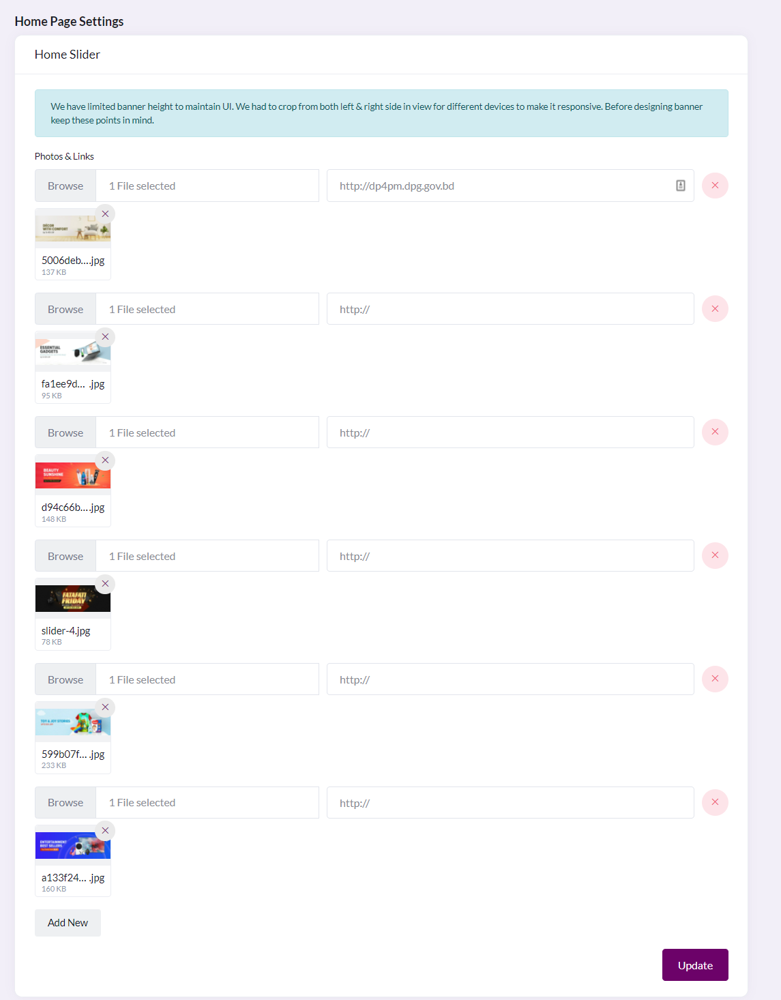

# Admin Feature

- [Website-Settings](#website-settings)
- [Configuration](#website-configuration)

The admin has to [login](#) first. They will be redirected to their dashboard.

In the dashboard there several feature available in sidebar menu. And it will appear based on role and permission.
**All Available Website Setup Menu**

# Website-Settings
- [Header](#header)
- [Footer](#footer)
- [Pages](#pages)
- [Appearance](#appearance)

# Header 

**This feature will allow the user to change different aspects of the header in the website.**

**Header Logo**- This allows us to change the logo that appears in the header, and it can be customized according to the organization that is being hosted in this platform. The user can click "Browse" to select the photo that will be used as the Header Logo. 

**Show Language Switcher** - This switch allows us to toggle the option to show different language that the website supports. Having this on means that the customer can see a menu in the header that allows them to choose between different language options in order to see the text in the website

**Show Currency Switcher** - This toggle allows the customer to see an option in the header that allows them to choose between different currency options, depending on what the e-commerce platform currently supports. This can be useful for showing the currency in a value that is familiar or local to the users of the platform rather than an international standard such as the US dollar

**Enable stikcy header** - This option/toggle allows the header to scroll along as the customer scrolls the homepage of the website. That means that no matter where the customer is scrolling on the website, the header will always stay at the top while the bottom part after that will scroll as the viewer requires 

**Topbar Banner and Link** - The topbar banner is an option to choose an image file that will show at the very top of the website in the homepage. We can also embed a link with that image so that when a user clicks on that banner it will redirect them to that link. The link is provided below

**Header Nav Menu** - The header NAV menu lists all the different menu items that are available in the websites homepage under the catalogue all categories. This is entirely configurable and can be said according to whatever link the webmaster wants to redirect

# Footer 

**This feature deals with the footer of the website, and the relevant components that are in the footer section.**

**Footer Logo** - The Footer logo is the image that is placed at the bottom of the page, similar to the header logo. It can be chosen by selecting the "Browse" button and selecting the image.

**About Description** - This will add a small description below the Subscribe test, referring to a text to describe a reason for subscribing to the mailing list. 

**Play Store Link** - The play store link refers to a link where the user can download an app for android devices. 

**App Store Link** - The app store link refers to a link where the user can download an app for Apple devices. 

**Contact Info Widget** - The contact info which it refers to contact details that will show in the footer that refer to the organization hosting the marketplace

**Footer Bottom** - This refers to text that appears at the bottom of the website and can be used to show a message or declare a copyright statement

**Social Link Widget** - Social link widget can be used to show different links to social media such as Facebook Twitter Instagram YouTube or LinkedIn. These are other platforms where customers can follow the marketplace

**Payment Methods Widget** - Payment methods Widget allows you to upload different pictures to represent which types of payment gateways are excepted as transaction mediums in this website. This only allows to upload pictures or logos of those companies which provide payment gateway services so that customers can be aware of the payment gateways accepted before proceeding to shopping. 

# Pages 

**The feature allows us to add or configure different options in pages of the website.**

**Home page** - Home page maintains a different format from all other pages as it is special due to its nature. The home page has a lot of options which can be configured. Here are a list of those features:

* **Home Slider:** The home slider contains the ability to upload images that will appear as banners in the main slider of the homepage. This can be promotional posts or deals that are currently running in the platform. The images have a standard size of X by X. The images can also have a link associated with them so that when a viewer clicks on the image, it will redirect them to a website that tells more about what is being represented.

* **Home Banner 1,2:** Home banner represents images that are static in the homepage. They are positioned in the top and bottom areas of the website in between the header and footer. These are images that can be linked with the URL so that viewers can learn more.

* **Top 10:** Top 10 are a few categories that appear near the footer. They are primarily consisting of two different categories – top categories, which comes from the categories defined in the website, and top brands, also defined in the website. 

**Other pages:**

Besides the home page, all other pages have a standard template. Those fields are described below:

**Title:** It sets the title of that page.

**Link:** The link defines the URL at which this page is found.

**Add content:** This is where the text that is displayed in the website is posted.

The SEO fields are meta-data that helps to optimize The links.

# Appearance

**This feature allows us to change some details about the website overall**

**Frontend website name:** This is the title that appears for the website in the browser tab.

**Site motto:** This text appears next to  the website name in the browser tab title.

**Site icon:** This is a small logo that appears in the website title to the left of the tab.

**Website base colour:** This defines the colour of the overall background for the website.

**Global SEO fields** - THese data fields helps to optimize the website to be discovered in search engines such as Google Bing DuckDuckGo, etc.

**Cookie agreement:** This is the text that appears at the bottom of the website screen view, that requires consent from viewers to agree to use cookies as used in the website.

**Website pop-up:** This is a pop-up banner that appears whenever the URL for the website is first loaded. It allows us to show the viewer an exclusive sale/promotional post, etc. 

**Custom script:** These are HTML embedded javascript code that we can we can use for the header and footer

# Website-Configuration
- [General Settings](#general-settings)
- [Feature Activation](#features-activation)
- [Languages](#languages)
- [Currency](#currency)
- [VAT and TAX](#vat-and-tax)
- [Pickup Point](#pickup-point)
- [SMTP Settings](#smtp-settings)
- [Payment Methods](#payment-methods)
- [File System and Cache Configuration](#file-system-and-cache-configuration)
- [Social Media Logins](#social-media-logins)

# General Settings

**This feature allows us to change some general configuration settings for the overall site**

**System name:** This is the title that appears for the website.

**System logo white:** This is the title that appears for the website.

**System logo black:** This is the title that appears for the website.

**System timezone:** This is the title that appears for the website.

**Admin Login page background:** This changes the background image for admin login page.

# Features Activation

**This feature provides toggles for all the different payment methods which are supported as well as all social media plugins which should be integrated with the platform while it is running**

Currently, four payment methods (SSLCommerz, Bkash, Nagad, Amarpay) are supported, while more can be added later. All of these functions have an option to configure, and that will redirect to the [Payment Method](#payment-methods) page.

As for social media,the ones supported currently are Facebook, Google, and Twitter. Clicking on the configure button in any will redirect to the [Social Media Logins](#social-media-logins) page

# Languages

**This feature allows us to change language settings for the overall site**

**Default language:** It is the language with which the website initially loads whenever new visitor visits the site. Currently it supports two languages - English and Bangla, and more can be added in the future

**Import App Translations:** This can import English translation files using an ARB file.

# Currency

**This feature allows us to change some general configuration settings for the currencies used in the system**

**System default currency:** This is the default currency in which all items in for sale in the system will appear

**Set currency formats:** this will set how the currency will appear in the websites.

**Symbol format:** this represents how the currency and its symbol will be placed 

**Decimal separator:** this represents how decimals will be used for representing the currency.

**Number of decimals:** this represents the precision to which the units of currency will be represented.

**All Currency:** This refers to all the different currencies that are available to be used in the platform. There is a toggle which allows us to include those currencies in the system. At the corner, options allows us to set the currency exchange rate.

# VAT and TAX

**This feature allows us to control whether VAT will be shown with MSRP prices**

# Pickup Point

**Pick up point refers to the different locations at which users of the system can go to pick up the delivery of their ordered items.**

Here we can edit the details for exisiting pickup points or create a new pickup point.

**Name** is the name of that pick up point

**Location** is the address of that pick up point

**Phone** is the phone number associated with the pick up point 

**Pick up point status** is a toggle that allows us to show whether or not the pick up point is currently available for operations

**Pick up point manager** represents the person who is to be contacted with regards to this pick up location

# SMTP Settings

**SMTP settings are mail configuration settings that are used in order for us to use the email associated with the platform.**

**Type** refers to the protocol for the email communication

**Mail host** is the host address for the email portal

**Mail port** is the port number that is used for that mail host

**Mail username** is the username with which the email address is associated

**Mail password** is the password to that account

**Mail encryption** refers to the encryption method/protocol which is used for securing communications

**Mail from address** is the address from which the emails will be sent 

**Mail from Name** is the name that will be associated with that email address

**Test SMTP configuration** allows us to send a test email to that email address to see if it is working with that configuration 

# Payment methods

**Configurations for payment methods are the different credentials needed in order to use the payment methods. Each of the fields are described in their appropriate labels**

# File System and Cache Configuration

**File system and cache configuration refers to the various configurations credentials and details that are needed in order for us to use a cloud virtual machine to store relevant data.**

                                                                                                                                                                                                                                                                            

# Social Media Logins

**Social media logins refers to the different login credentials for the different social medias that are used in the system. For each of these, we currently require the ID and password in order to login to the system.**

