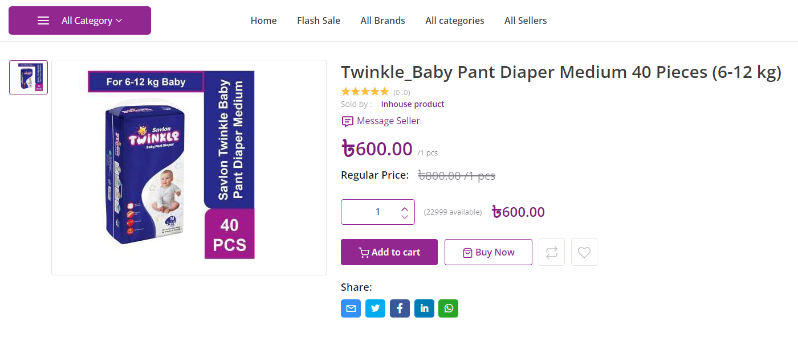
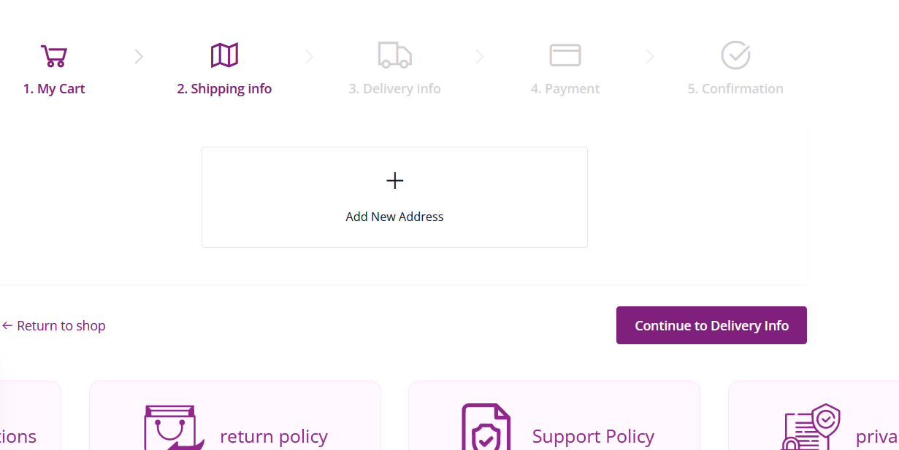
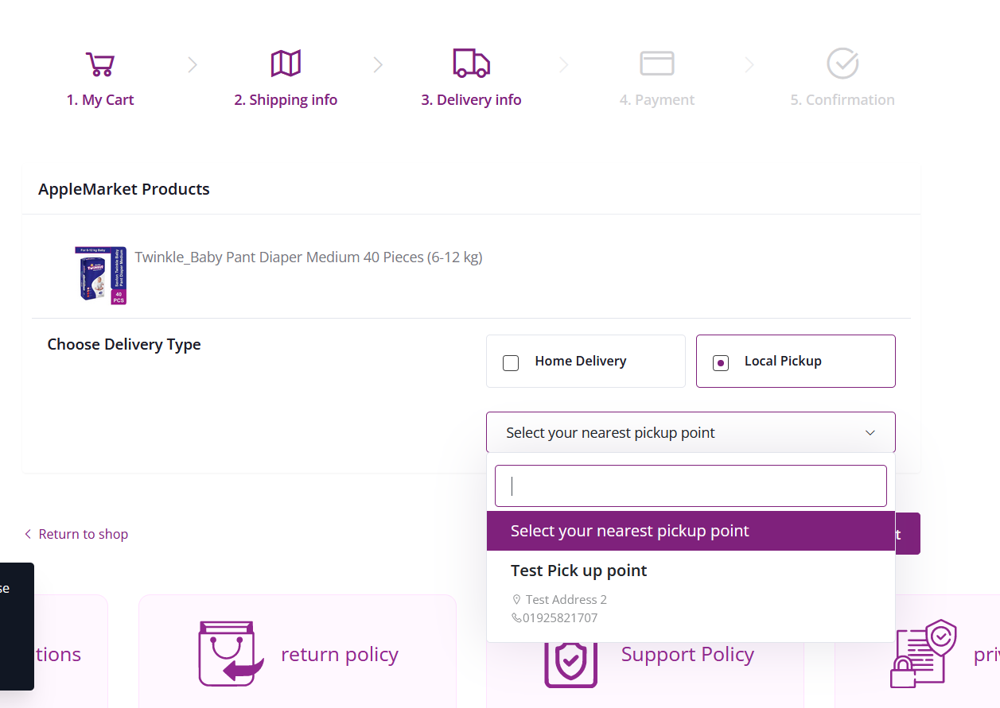

# Checkout Process

Find the the product you wish to buy and click "Add to cart"

Once added to cart, we can go back to shopping or "Proceed to Checkout". In this case, we will proceed to checkout.

We can now see the product in the cart as well as the price. We can now click on "Continue to Shipping" to proceed with the purchase.

At this point, we must login to the system, if we have not yet logged in. In this case, we are not logged in, so we will create a new account to login. There is the option to login using facebook or twitter, but for this demonstration, we will log in using Email. 

We can now register a new account by filling up the necessary details

The new email used for the account must be verified by email, and there should be an email from the platform to verify the mail like this. 

Once logged in, we can now proceed to add a delivery address.

We can now fill up the fields to complete the address

We have to now select the newly created address and click on "Continue to Delivery Info"

With that, now we have the option of selecting how we wish to get the product. One option is selecting a pickup point, which is already defined by the website admin, or we can choose Home Delivery. In this case, we will select "Home Delivery"

Here we can view the order details once more and choose a payment option. Cash on delivery is an option available but we can also choose to pay using an online payment system. For simplicity, we choose "Cash on Delivery" and click "Complete Order"

We can now finally see that the order is complete with a summary of the order details.