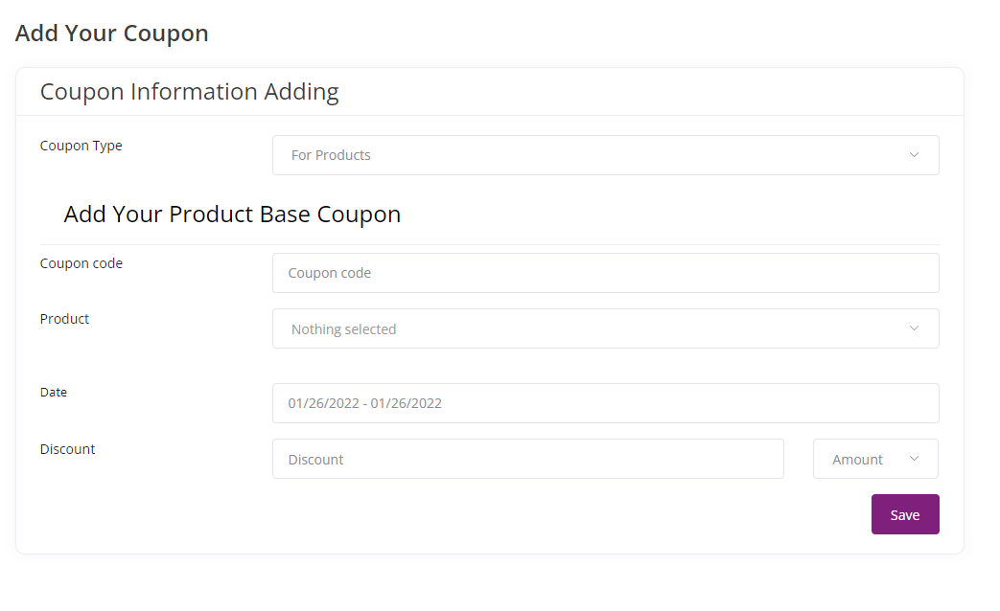

# Merchant Feature

 

- [Dashboard](#dashboard)
- [Purchase History](#purchase-history)
- [Digital Purchase History](#download)
- [Wishlist](#wishlist)
- [Compare](#compare)
- [Products](#products)
- [Product Bulk Import](#product-bulk-import)
- [Digital Products](#digital-product)
- [Uploaded Files](#uploaded-files)
- [Coupon](#coupon)
- [Orders](#orders)
- [Product Reviews](#product-reviews)
- [Shop Settings](#shop-settings)
- [Payment History](#payment-history)
- [Money Withdraw](#money-withdraw)
- [Conversations](#conversations)
- [My Wallet](#my-wallet)
- [Support Ticket](#support-ticket)
- [Edit Profile](#edit-profile)

   

# Dashboard

**The Dashboard contains the overall summary of the seller profile.**

**Sold Amount (Current Month)** Current Month Sold Amount

**Total Sold Amount** Total Sold Amount

**Sold Amount (Last Month)** Last Month Sold Amount

**Total orders** Total Order Count

**Pending orders** Pending Order Count

**Cancelled orders** Cancelled Order Count

**Successful orders** Delivered Order Count

  

# Purchase History

**Seller can also buy product, this list contains all the product information.**

  

# Digital Purchase History

**This list will show all the digital digital product that you have been purchased.**

  

# Wishlist

**This list contains all the favorite item that you have marked. You can remove this item by deleting the favorite item.**

  

# Compare

**You can compare multiple product here, Just add some item for compare and click compare.**

  

# Products

**All of your product will be listed here. You can add new product form here by clicking Add New Product button.**

# Add New Product

**This feature allows us to add a new product into the inventory list of items available in the website. It allows us to qualify all the different criterias and specifications of the product, as well as it's relevant files and images.**

**Product name** This is the name that will appear for that product in the website

**Category** This is the category under which this product falls under. These categories are already defined previously and will appear as a drop-down list to choose from.

**Brand** is the company brand to which this item belongs and these brands will be predefined and come as a drop-down list.

**Unit** refers to the unit by which we can measure these items so this can be pieces or a weight to like kilograms etc.

**Minimum purchase quantity** is the minimum number of items of it that must be purchased at at a time. The default value is one.

**Tags** refer to words that can be used to find this item if it is searched. This helps the customer to find the item more easily even if they are unable to define it by its exact name. 

**Gallery images** These are images that will appear of that product in large size. The default size configuration for images in the gallery is 600 pixels by 600 pixels.

**Thumbnail image** is a small image that will appear in the search results or in other areas in the website. There should be some blank space around the main object of the image in the thumbnail image because sometimes the image is cropped in order to fit into certain shapes or user interfaces.

**Shipping configuration**

*Free shipping* sets the shipping cost to be completely free.

*Flat rate* is if the shipping fee is a fixed rate no matter how many items is purchased

*Is Product Quantity Multiply* refers to if the shipping will be multiplied for every item that is shipped. For example, if one item's shipping cost is five dollars - if we select this toggle, that means if two items are selected then the shipping cost will be 5X2 = $10.

**Low stock quantity warning** This refers to a warning sign that will be presented in the product page whenever a stock of this item goes to this fixed number or lower. The default quantity for this is one.

**Stock visibility state**
We can select this toggle if we want to show how many of the stock is available in our inventory

*Hide stock* means that the stock quality will be hidden from the customer view

**Product Videos**

**Video provider** is a reference to a third-party website where we can host product demo video or other related videos to the product.

**Video link** is the link in which that product video can be found

**Product variation** refers to attributes that are associated with this product, if it is relevant. 

*Colour* refers to the colour of this particular item that is available

*Attributes* refers to attributes which can be selected if they are relevant for the product. Once an attribute is selected, a new item will appear which refers to more details for that attribute and can be selected.

**Product price + stock** 

**Unit price** is the price of each item of this product

**Discount date range** This is a date up to which we can specify a discount on this product. This discount value is determined below

**Discount** This is the value that will be discounted for the customer. This value is further defined as either a flat value or a percentage, which is selected to the right.

**Quantity** This refers to how many of this item we have available in stock 

**SKU** is the barcode that to be scanned of that item

**External link** refers to any additional resource or a link that the customer can visit to to learn more about this item

**Cash on delivery** toggle is a toggle to let customers know if this service is offered for this product.

**Featured status** refers to if this item will be featured amongst the other items in the website's home page or search results.

**Today’s deal** This toggle refers to if this item will be included in today’s deals in the home page.

**Flash deal** refers to if we want to list this product as a flash sale item for the flash deals. 

**Add to flash** refers to which flash sale or campaign currently on-going do we want to include this product under. 

**Discount** refers to the amount that is discounted from the price and this discount type can be either fixed or it can be a percentage

**Product description** This provides a text editor to include detailed writing to give a description about this product

**PDF specifications** refers to any PDF that may have more details about the product and can be uploaded along with this product

**SEO Meta Tags** refers to search engine optimization descriptions and images which can be attached for optimizing its discoverability

**Estimated shipping time** refers to an estimated shipping date that can be generally provided for this item regardless of where it is being shipped

  

# Product Bulk Import

**This feature allows us to import data from csv files all at once into the website**

We can directly import lots of detail files into the system by using the bulk upload feature

We can import all the product files by uploading a CSV file that contains all the products as long as it is formatted in the appropriate manner

We can also upload bulk category and brand by formatting it in the appropriate manner

  

# Digital Products

**This feature allows us to view, add or edit digital products that are listed in the platform**

Digital product refers to a product which is not physical in its nature and doesn’t have to be shipped. Rather, it is something that is digital in its nature. For example, it can be a code for getting a license for Software and this code can be delivered by email or some other free electronic means. 

**Add New Digital Product** To add a digital product we have to add a few entries for the relevant details

**Product name** refers to the name of that digital product

**Category** refers to which category this particular product belongs in and this is defined previously so that the options appear in a dropdown list

**Product file** This is the file that is to be sold as a digital product

**Tags** refer to words that can be used to find this item if it is searched. This helps the customer to find the item more easily even if they are unable to define it by its exact name. 

**Main Images** these are the images that represents this product, and will be displayed as gallery images.

**Thumbnail image** is a small image that will appear in the search results or in other areas in the website. There should be some blank space around the main object of the image in the thumbnail image because sometimes the image is cropped in order to fit into certain shapes or user interfaces.

**Unit price** is the price of each item of this product

**Purchase price** is the price of each item of this product 

**Tax** This is the amount of tax that the product will be charged. It can be a fixed amount or percentage of the cost.

**Discount date range** This is a date up to which we can specify a discount on this product. 

**Discount** This is the value that will be discounted for the customer. This value is further defined as either a flat value or a percentage, which is selected to the right.

**Product information description** is the details of this product

  

# Uploaded Files

**All the files you have uploaded in this system will be listed here.**

  

# Coupon

**All the discount coupon will be listed here.**

  

# Add New Coupon

**There are two types of coupon (For Product and For Order).**

  

# Order

**All the order will be listed here.**

  

# Product Reviews

**All the review releted to your product will be listed here.**

  

# Shop Settings

**Seller can manage his/her shop profile by using this page.**

  

# Payment History

**All the payment received from platform will be listed here.**

  

# Money Withdraw

**All the withdraw request will be listed here. Seller can add new request from here.**

